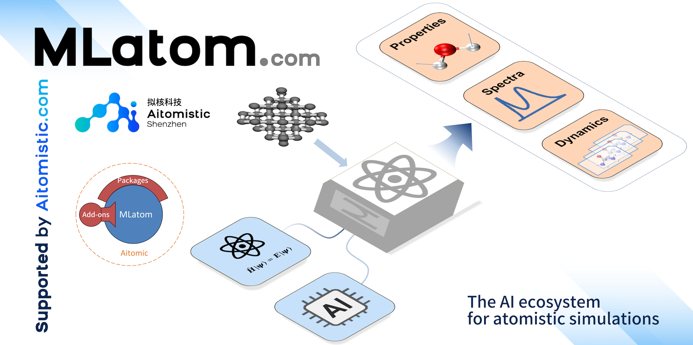

<p align="center">
  <a href="http://mlatom.com"></a>
</p>

<p align="center">
  <a href="https://github.com/dralgroup/mlatom/actions/workflows/ci.yml"></a>
  <a href="https://pypi.org/project/mlatom/"></a>
  <a href="https://pepy.tech/project/mlatom"></a>
  <a href="https://pepy.tech/project/mlatom"></a>
  <a href="LICENSE"></a>
  <a href="http://mlatom.com/docs"></a>
</p>

# MLatom

MLatom is an open-source package for **atomistic simulations with machine learning and quantum chemical methods** — DFT, wavefunction-based, and semi-empirical approximations. Use it as a Python library, through input files, or from the command line — run it locally, or online with no installation.

**[Website](http://mlatom.com)** · **[Documentation](http://mlatom.com/docs)** · **[Protomia](https://aitomistic.com/protomia)** · **[Aitomistic Hub](https://aitomistic.xyz)** · **[Aitomistic Lab@XMU](https://atom.xmu.edu.cn)** · **[Releases](http://mlatom.com/docs/releases.html)**

## Run online — no installation

Run MLatom in your browser on either online platform — both powered by [Protomia](https://aitomistic.com/protomia), with an AI assistant for autonomous atomistic simulations:

- **[Aitomistic Hub](https://aitomistic.xyz)** — registration-free.
- **[Aitomistic Lab@XMU](https://atom.xmu.edu.cn)** — free for academic users (registration with an academic email).

## Local installation

The easiest way to run MLatom is [online](http://mlatom.com/docs/cloud.html) — no installation. To run the **AIQM2** quick start below locally, install MLatom together with the specific PyTorch/TorchANI versions it needs, a geometry-optimization backend, and the DFT-D4 program (via conda):

```bash
pip install -U "numpy<2" "torch==2.1.2" "torchani==2.2.3" "setuptools<81" mlatom joblib requests psutil pyscf geometric
conda install -c conda-forge dftd4
export dftd4bin=$(which dftd4)   # point MLatom at the dftd4 executable
```

See the [installation guide](http://mlatom.com/docs/installation.html) for the full dependency list and other methods.

## Quick start

Optimize the geometry of a water molecule with **AIQM2** — an AI-enhanced quantum-mechanical method (native to MLatom, CHNO elements) that reaches beyond-DFT accuracy at semi-empirical cost:

```python
import mlatom as ml

mol = ml.data.molecule.from_xyz_string('''3

O    0.00000    0.00000    0.11779
H    0.00000    0.75545   -0.47116
H    0.00000   -0.75545   -0.47116
''')
aiqm2 = ml.methods(method='AIQM2')
opt = ml.optimize_geometry(model=aiqm2, initial_molecule=mol).optimized_molecule
print(opt.energy)          # optimized energy in hartree (≈ -76.3838)
```

The same calculation as an input file (`geomopt.inp`, with `init.xyz` holding the geometry):

```
AIQM2               # method
geomopt             # task: geometry optimization
xyzfile=init.xyz    # input geometry
optxyz=opt.xyz      # output geometry
```

```bash
mlatom geomopt.inp
```

Prefer zero setup? Run these online on the [Aitomistic Hub](https://aitomistic.xyz) or [Aitomistic Lab@XMU](https://atom.xmu.edu.cn) (both powered by [Protomia](https://aitomistic.com/protomia)) — no installation needed.

## Features & documentation

Full manuals and tutorials are at **[mlatom.com/docs](http://mlatom.com/docs)** — begin with [installation](http://mlatom.com/docs/installation.html) and [get started](http://mlatom.com/docs/get_started.html).

- **Methods** — universal ML potentials (ANI, AIMNet2); AI-enhanced QM methods ([UAIQM](http://mlatom.com/docs/tutorial_uaiqm.html), [AIQM1](http://mlatom.com/docs/tutorial_aiqm1.html), [AIQM2](http://mlatom.com/docs/tutorial_aiqm2.html)) approaching coupled-cluster accuracy at semi-empirical cost; and DFT, semi-empirical, and wavefunction methods via interfaces (PySCF, Gaussian, ORCA, xtb, MNDO, Turbomole, DFTB+, Sparrow, Columbus).
- **ML models** — [train and use ML potentials](http://mlatom.com/docs/tutorial_mlp.html) (KREG, GAP-SOAP, ANI, MACE, and more) with [active learning](http://mlatom.com/docs/tutorial_al.html), Δ-learning, [transfer learning](http://mlatom.com/docs/tutorial_tl.html), and self-correction.
- **Simulations** — [geometry optimization](http://mlatom.com/docs/tutorial_geomopt.html), [transition-state search](http://mlatom.com/docs/tutorial_ts.html), [IRC](http://mlatom.com/docs/tutorial_irc.html), [frequencies & thermochemistry](http://mlatom.com/docs/tutorial_freq.html), [molecular dynamics](http://mlatom.com/docs/tutorial_md.html), [nonadiabatic dynamics](http://mlatom.com/docs/tutorial_namd.html), [IR](http://mlatom.com/docs/tutorial_ir.html)/[Raman](http://mlatom.com/docs/tutorial_raman.html)/[UV–vis](http://mlatom.com/docs/tutorial_uvvis.html) spectra, and [periodic boundary conditions](http://mlatom.com/docs/tutorial_pbc.html).
- **Workflows** — compose methods and tasks into complex pipelines from Python, input files, or the command line.

## How to cite

If you use MLatom in scientific work, please cite:

> Pavlo O. Dral et al. *MLatom 3: A Platform for Machine Learning-Enhanced Computational Chemistry Simulations and Workflows.* **J. Chem. Theory Comput.** 2024, *20*, 1193–1213. [DOI: 10.1021/acs.jctc.3c01203](https://doi.org/10.1021/acs.jctc.3c01203)

Feature-specific references appear in the program output and in [`CITATION.cff`](CITATION.cff). The full list with BibTeX is on the [License and citations](http://mlatom.com/docs/license.html) page.

## Ecosystem

- **[MLatom Skills](https://github.com/dralgroup/mlatom-skills)** — agent skills for MLatom (new and growing rapidly).
- **[Aitomic add-ons](http://mlatom.com/docs/addons.html)** — cutting-edge methods (e.g. AIQM3), free for academic, non-commercial use.
- **[Aitomia](https://github.com/dralgroup/aitomia)** — an AI assistant for autonomous atomistic simulations with MLatom.

## Recent releases

Full [release notes](http://mlatom.com/docs/releases.html) · [`CHANGELOG.md`](CHANGELOG.md)

- **3.23** — **[AIQM3](http://mlatom.com/docs/tutorial_aiqm2.html)**, the latest AI-enhanced quantum-mechanical method — coupled-cluster accuracy at semi-empirical cost across seven main-group elements ([paper](https://doi.org/10.1021/acs.jctc.5c01794)) — as a public add-on (`pip install aitomic-addons`); direct Gaussian workflows (geometry optimization, frequencies, IRC, TD); version/commit/build-date startup banner.
- **3.22** — **[OMNI-P2x](http://mlatom.com/docs/tutorial_omnip2x.html)**, the first universal neural-network potential for excited states ([paper](https://doi.org/10.26434/chemrxiv-2025-j207x)); faster [nonadiabatic dynamics](http://mlatom.com/docs/tutorial_namd.html).
- **3.21** — refactored [ORCA interface](http://mlatom.com/docs/tutorial_es_methods.html) supporting many more excited-state methods.
- **3.18** — **[FSSH](http://mlatom.com/docs/tutorial_namd.html)** (fewest-switches surface hopping for nonadiabatic dynamics); **[MDtrajNet-1](http://mlatom.com/docs/tutorial_mdtrajnet.html)**, a foundational model that generates molecular-dynamics trajectories directly across chemical space; **[KRR in Julia](http://mlatom.com/docs/tutorial_krr_julia.html)**; and **ECTS**, an ultra-fast diffusion model for exploring reactions and generating transition states ([paper](https://doi.org/10.26434/chemrxiv-2025-f9vdp)).

## Contributing

Contributions are welcome — see [CONTRIBUTING.md](CONTRIBUTING.md) and the [Code of Conduct](CODE_OF_CONDUCT.md). Report bugs and request features via [GitHub issues](https://github.com/dralgroup/mlatom/issues). You may also create your own private derivatives by following the license requirements.

## Stay updated

Don't miss MLatom updates — [subscribe](https://aitomistic.com/en/contact) to the Aitomistic email newsletter and social channels.

## About

MLatom was founded by [Pavlo O. Dral](http://dr-dral.com) on 10 September 2013, who continues to lead its development. It is open-source under the Apache License 2.0 and supported by [Aitomistic](https://aitomistic.com).
